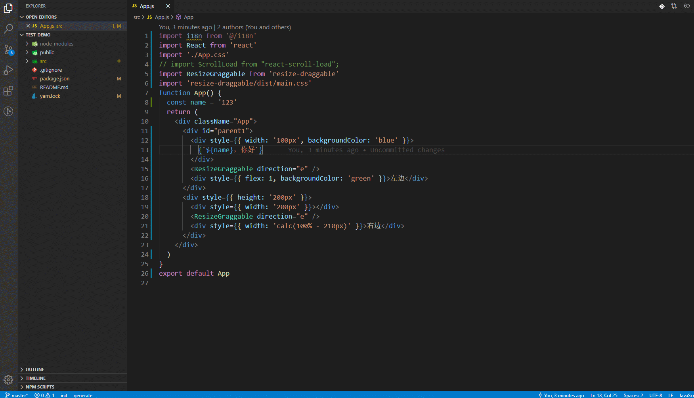

# ext-intl README

Based on TypeScript AST APIs, a tool for extracting and replacing Chinese entries from React component / js source files

## Screenshots

## Requirements

This plugin depends on the i18n solution [ext-intl](https://www.npmjs.com/package/ext-intl). Learn more about how to use it from it.

### For more information

- [ext-intl](https://www.npmjs.com/package/ext-intl)

**Enjoy!**
